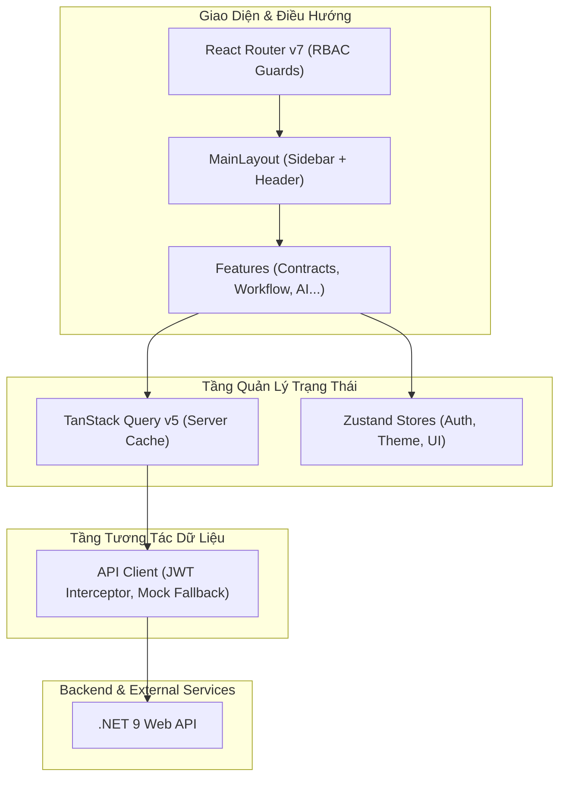

# Kiến Trúc Ứng Dụng Frontend (Architecture)

## 1. Tổng Quan Kiến Trúc (High-Level Architecture)

Ứng dụng Frontend cho Hệ thống Quản lý Vòng đời Hợp đồng Doanh nghiệp (CLM) được xây dựng theo mô hình **Feature-Driven Single Page Application (SPA)**, tối ưu cho khả năng mở rộng khi làm việc nhóm và bảo trì lâu dài.

---

## 2. Nguyên Tắc Quản Lý Trạng Thái (State Management)

Hệ thống phân định ranh giới rõ ràng giữa 2 loại trạng thái:

1. **Server State (Dữ liệu từ API Backend)**:
   - Được quản lý tập trung bởi **TanStack Query v5**.
   - Cung cấp tính năng caching tự động (`staleTime: 5 phút`), tự động hủy request cũ khi component unmount, ngăn ngừa race-condition.
   - Tuyệt đối không copy server state vào `useState` cục bộ nhằm tránh dữ liệu bị phân mảnh và lỗi đồng bộ.

2. **Client Global State (Trạng thái phiên giao diện)**:
   - Sử dụng **Zustand** cho các thông tin xuyên suốt:
     - `useAuthStore`: Thông tin tài khoản đăng nhập, Token JWT, Quyền hạn (Role: Admin, Manager, Staff, Approver).
     - `useUIStore`: Trạng thái thu gọn/mở rộng Sidebar, danh sách thông báo chưa đọc.

3. **Local Component State**:
   - Sử dụng `useState` cho modal toggle, tab đang chọn, filter search tạm thời.

---

## 3. Cơ Chế Phân Quyền (RBAC - Role-Based Access Control)

Hệ thống hỗ trợ 4 vai trò chính:
- **Admin**: Quản trị cấu hình, phân quyền người dùng, xem toàn bộ hợp đồng trong doanh nghiệp.
- **Manager (Trưởng phòng)**: Phê duyệt hợp đồng cấp phòng ban, giao việc soạn thảo cho nhân viên.
- **Staff (Nhân viên kinh doanh/mua sắm)**: Soạn thảo hợp đồng mới, tải tài liệu đính kèm, trình duyệt hợp đồng.
- **Approver (Ban Giám đốc/Kế toán trưởng)**: Phê duyệt các hợp đồng có giá trị lớn, ký số điện tử.

Các routes được bảo vệ bởi Route Guards kiểm tra quyền trước khi cho phép người dùng truy cập.

---

## 4. Quản Lý Vòng Đời Hợp Đồng (State Machine Trực Quan)

Một trong những tính năng cốt lõi của frontend là trực quan hóa trạng thái hợp đồng:
- `Draft`: Hợp đồng mới tạo nháp.
- `PendingApproval`: Đang trong tiến trình phê duyệt nhiều cấp.
- `Approved`: Đã duyệt xong các bước, sẵn sàng ký số.
- `Signed`: Đã được đại diện 2 bên ký điện tử.
- `Active`: Hợp đồng chính thức có hiệu lực pháp lý.
- `Expiring`: Hợp đồng còn dưới 30 ngày trước khi hết hạn (cảnh báo).
- `Terminated`: Đã thanh lý hoặc chấm dứt trước hạn.
- `Renewed`: Đã được tái ký gia hạn.

Mỗi trạng thái đi kèm màu sắc và biểu tượng nhận diện riêng biệt giúp người dùng nắm bắt tình trạng trong 1 giây.
